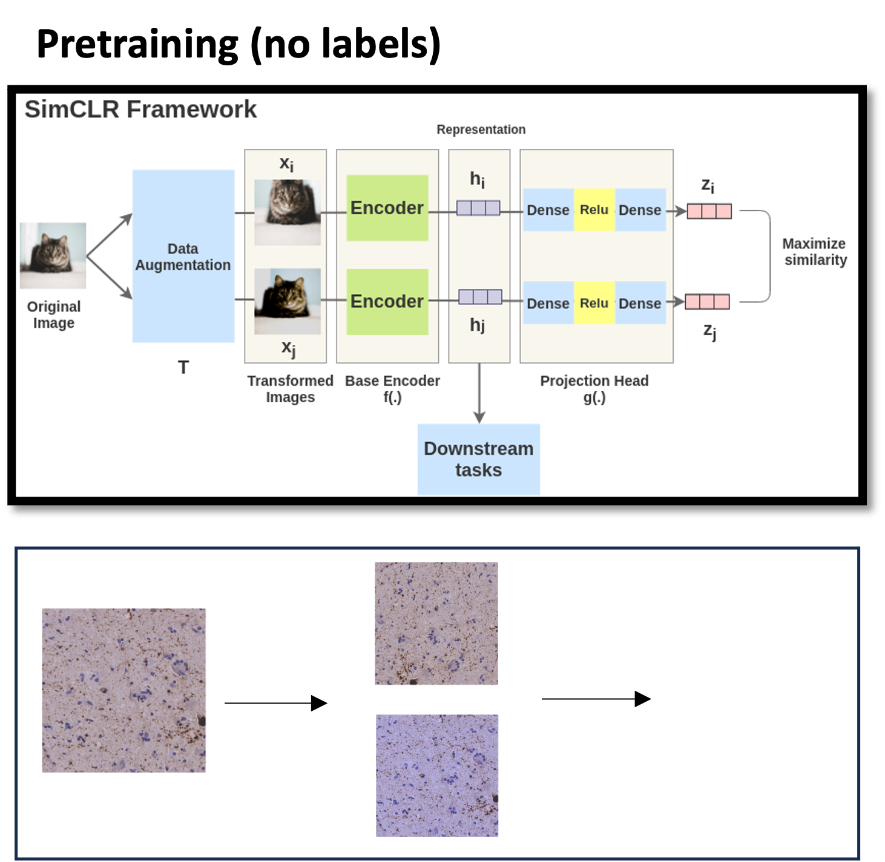
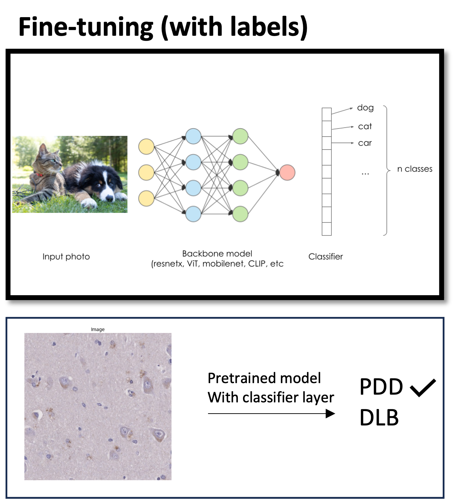
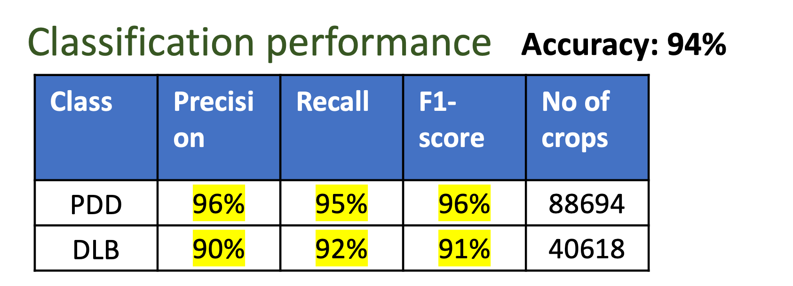
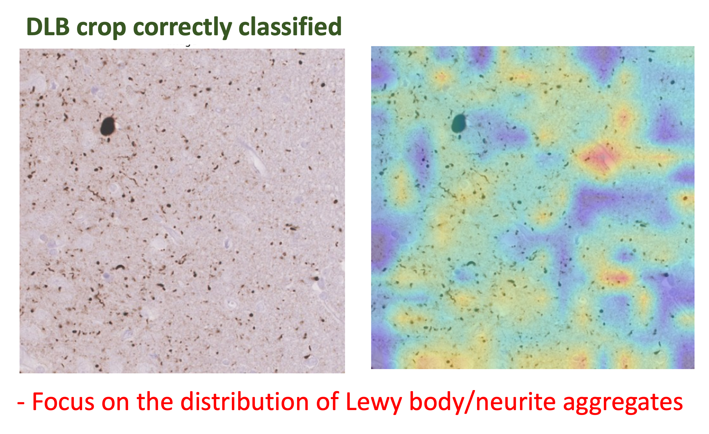
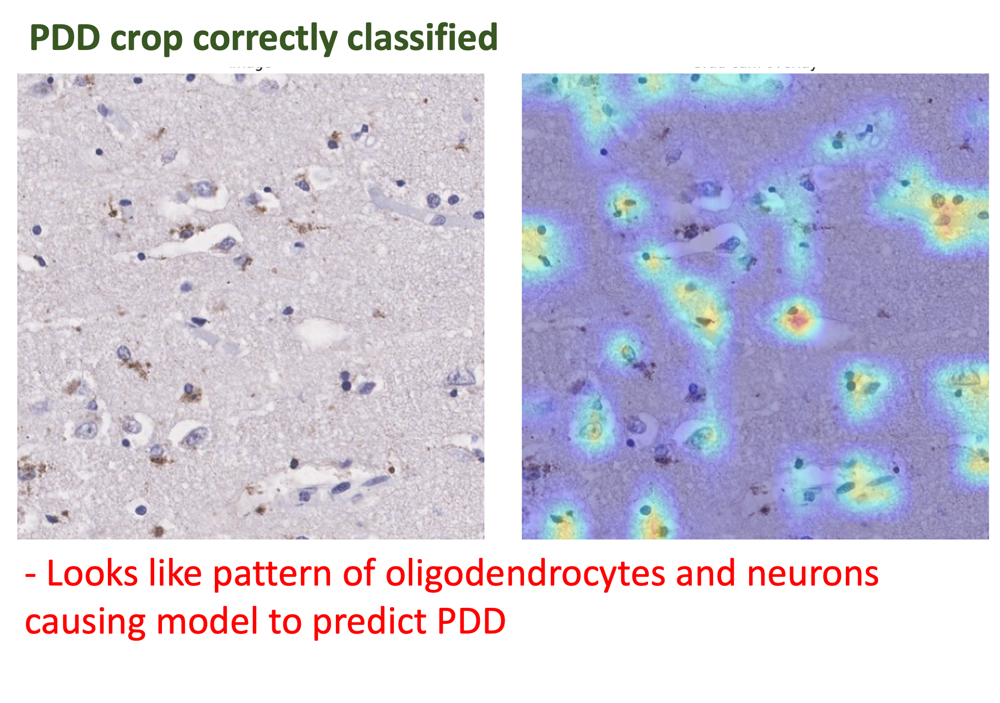

# Training a crop based classifier

## Pretrained crops from alpha syn stained slides of PDD and DLB brains 

The pretraining is done using SimCLR model.

      

  *Pretraining*

## Fine-tuned crops with weak labels as PDD or DLB 

Fine-tune the crops using pretrained model as backbone to classify crop as PDD or DLB 

      

  *Finetuning*

      

  *Model Performance*

## Apply gradcam to see features responsible for model's prediction

      

  *DLB crop*

      

  *PDD crop*

